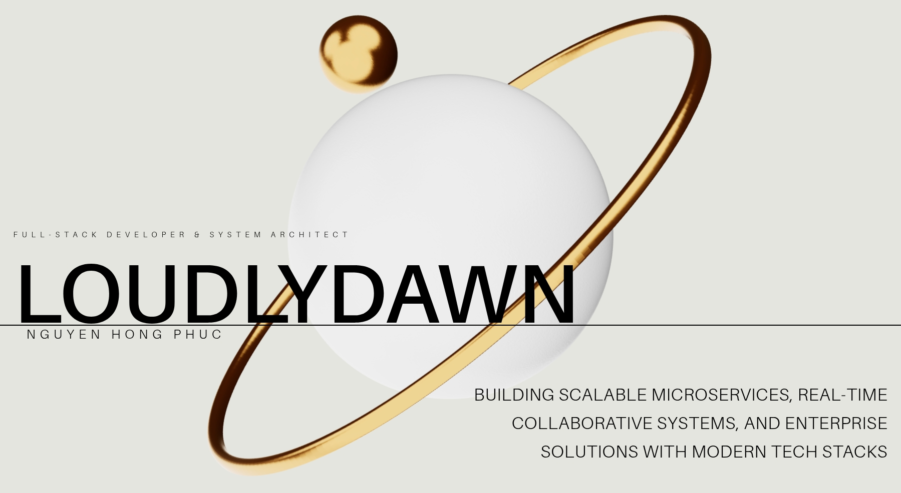

# 💼 LoudlyDawn's Developer Portfolio

<a href="https://github.com/LoudlyDawn2108/my-portfolio-final" target="_blank">
  
</a>

### Full-Stack Developer & System Architect

A fully animated, interactive 3D portfolio showcasing my projects in **microservices architecture**, **distributed systems**, and **cloud-native development**. Built with modern web technologies and production-level code.

---

## 👨‍💻 About Me

Full-stack developer specializing in microservices architecture and real-time systems. Currently pursuing a Bachelor's degree in Software Engineering as a third-year student. Experienced with building scalable applications using TypeScript, Node.js, C#, Java, and cloud-native technologies.

### 🎓 Education
- **Bachelor of Science in Software Engineering** (Third Year)
- Focus: Distributed Systems, Microservices, Full-Stack Development
- Relevant Coursework: Data Structures, Algorithms, Software Architecture, Database Systems, Cloud Computing

### 💼 Experience
- **Software Engineering Intern** - Gaining hands-on experience with modern development practices and contributing to production systems

---

## 🚀 Tech Stack

### Frontend
- **React** with **Vite** - Modern UI development
- **Three.js** & **React Three Fiber** - 3D graphics and animations
- **Tailwind CSS** - Utility-first styling
- **GSAP** - Scroll-triggered animations
- **Framer Motion** - Smooth transitions and effects

### Backend & Infrastructure
- **Node.js** & **Express** - Server-side development
- **C#** & **.NET** - Enterprise applications
- **Java** - Backend services
- **Kafka** - Event streaming
- **Hazelcast** - Distributed caching
- **PostgreSQL** & **SQL Server** - Database management
- **Docker** - Containerization

---

## 🎯 Featured Projects

### 1. [PixelVerse](https://github.com/LoudlyDawn2108/pixelverse)
Real-time collaborative pixel canvas platform with microservices architecture
- **Tech**: Node.js, TypeScript, React, Kafka, Hazelcast
- **Features**: WebSocket real-time updates, distributed state management, event-driven architecture

### 2. [Netflix Clone](https://github.com/LoudlyDawn2108/netflix-clone)
Cloud-native, enterprise-grade streaming platform
- **Tech**: TypeScript, Java, C#, JavaScript
- **Features**: Microservices architecture, API gateway, full-stack implementation

### 3. [FantasticStock](https://github.com/LoudlyDawn2108/FantasticStock)
Stock management and analytics system
- **Tech**: C#, .NET, TSQL, SQL Server
- **Features**: Enterprise data management, analytics dashboard

### 4. [Drive](https://github.com/LoudlyDawn2108/drive)
Cloud storage solution built with T3 Stack
- **Tech**: Next.js, TypeScript, Drizzle ORM, tRPC
- **Features**: Modern authentication, database management

### 5. [CPU Scheduler Visualizer](https://github.com/LoudlyDawn2108/cpu-scheduler-viz)
Interactive visualization tool for CPU scheduling algorithms
- **Tech**: TypeScript, React, Vite, HTML5
- **Features**: SJF and SRTN algorithm visualization

### 6. [Caelestis](https://github.com/LoudlyDawn2108/caelestis)
Custom shell configuration and system utilities
- **Tech**: QML, C++, JavaScript, Shell
- **Features**: Enhanced development workflow, UI components

---

## 📁 Portfolio Features

- 🔥 3D Hero section with animated planet
- 🎓 Education section with academic background
- 💼 Experience section highlighting internship
- 🛠️ Services section showcasing technical expertise
- 📊 Works section with project showcase
- 👤 About section with professional background
- 📱 Fully responsive design
- ⚡ Smooth scroll-based animations
- 🎨 Modern UI/UX with GSAP and Framer Motion

---

## 📦 Setup & Installation

```bash
git clone https://github.com/LoudlyDawn2108/my-portfolio-final.git
cd my-portfolio-final
npm install
npm run dev
```

> Open http://localhost:5173 in your browser.

### Build for Production
```bash
npm run build
npm run preview
```

---

## 🛠️ Project Structure

```
src/
├── components/       # Reusable UI components
├── sections/        # Main portfolio sections
│   ├── Hero.jsx
│   ├── About.jsx
│   ├── Education.jsx
│   ├── Experience.jsx
│   ├── Services.jsx
│   ├── Works.jsx
│   └── Contact.jsx
├── constants/       # Project data and content
└── lib/            # Utility functions
```

---

## 🎨 Customization

Key files to personalize:
- `src/constants/index.js` - Update projects, services, and links
- `src/sections/Education.jsx` - Add university name and graduation year
- `src/sections/Experience.jsx` - Add company name and dates
- `src/sections/Contact.jsx` - Update contact information
- `public/images/` - Replace with your own images

---

## 📫 Contact

- **GitHub**: [@LoudlyDawn2108](https://github.com/LoudlyDawn2108)
- **LinkedIn**: [Connect with me](https://linkedin.com)
- **Email**: miracleworks105@gmail.com

---

## 📝 License

This portfolio is open source and available under the MIT License.

---

**Built with ❤️ by LoudlyDawn**